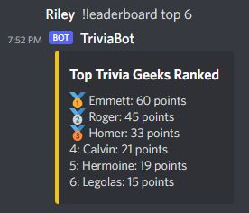

# Discord Trivia Bot
## A bot that lets users answer trivia questions!

Users can ask for a trivia question by specificying a category, difficulty, both, or niether and getting a random question

Users can get statistics on themselves such as their question accuracy

And they can get a leaderboard of the top trivia nerds on the server

